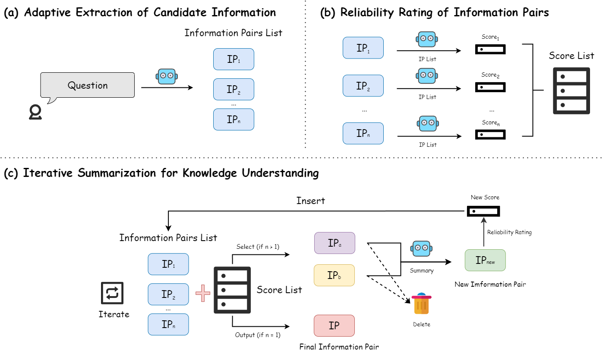
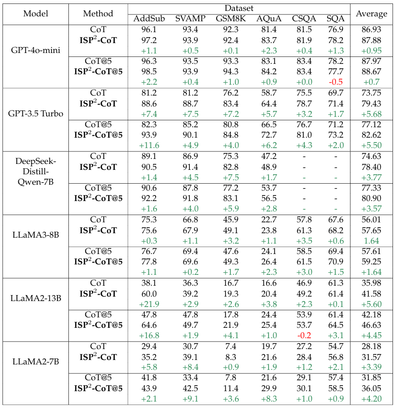

# Understanding Before Reasoning: Enhancing Chain-of-Thought with Iterative Summarization Pre-Prompting (ISP<sup>2</sup>)

[](https://arxiv.org/abs/2501.04341)




ISP<sup>2</sup> is a plug-and-play prompting method, as shown in Figure. It is can be easily combined with preivious works such as Chain-of-Thought and Self-Consistency, as they are orthogonal. The work was accomplished by Dong-Hai Zhu, Yu-Jie Xiong, Jia-Chen Zhang, Xi-Jiong Xie, and Chun-Ming Xia.


## News
- [07/06/2025]🔥: We have updated the architecture of ISP² in this version. By integrating the latest guidance library as the prompt generation module, we have achieved lower GPU memory requirements compared to the previous version, while enabling more purpose-driven prompt generation. For those who wish to build upon or improve this version, you can refer to the official documentation of the guidance library to effectively utilize it for optimizing your model interactions. Documentation link: [Guidance](https://guidance.readthedocs.io/en/stable/index.html). Moreover, our method extends beyond conventional Chain-of-Thought (CoT) and Complex CoT methodologies by incorporating Program-of-Thought (PoT) into the prompt architecture. Looking ahead, we will continue integrating innovative prompting paradigms into ISP², paving the way for groundbreaking advancements in reasoning.


## Setup OpenAI API

Please set `os.environ["OPENAI_API_KEY"]="YOUR_API_KEY"` in all python scripts.

Make sure that your device is able to connect to [OpenAI API](https://platform.openai.com/docs/api-reference). 

Of course, we also support users calling DeepSeek's API. For more details on how to use DeepSeek, please refer to [DeepSeek API](https://api-docs.deepseek.com/zh-cn/).

## How to Install

```
conda create -n ISP python==3.10
conda activate ISP
pip install -r requirements.txt
```


## Setup Model
Get your Llama2 weight on https://huggingface.co/meta-llama/Llama-2-13b-hf, set up on default directory: ./llama-2-13b-hf. Of course, you can also use the Llama3 model—please configure the path according to the default model name.

Thanks to Guidance's strong compatibility, our code also works with Mistral, Qwen2.5, and DeepSeek models.

Model Links: DeepSeek: [DeepSeek](https://huggingface.co/collections/deepseek-ai/deepseek-r1-678e1e131c0169c0bc89728d), Qwen 2.5: [Qwen 2.5](https://huggingface.co/collections/Qwen/qwen25-66e81a666513e518adb90d9e), Mistral: [Mistral](https://huggingface.co/mistralai)


## Run paper experiments
### GPT Experiment
You can use any openai model (`gpt-3.5-turbo`, `gpt-4`, etc.) as `YOUR_MODEL`.
- CoT:
`python main.py --model_name_or_path=YOUR_MODEL  --prompt_type=cot`
- Complex-CoT:
`python main.py --model_name_or_path=YOUR_MODEL  --prompt_type=comcot`
- CoT + ISP:
`python main.py --model_name_or_path=YOUR_MODEL  --prompt_type=dd`

### LLaMA/DeepSeek Experiment
You can use any model as `YOUR_MODEL`. We can just use the file in bash directory. For example:
'''
python llm_infer.py \
         --dataset "gsm8k" \
         --format "comcot" \
         --temperature 0.5 \
         --max_tokens 256 \
         --sc_num 5 \
         --model './Llama-3.1-8B' \
         --split 'final_test' 
'''

## Result
We show CoT and Complex CoT with GPT-3.5-Turbo and GPT-4o-mini Here. For more experiments results (such as LlaMA and DeepSeek), please refer to our [Paper](https://arxiv.org/abs/2501.04341).
<div align="center">
  
</div>

## Citation
```
@article{zhu2025understanding,
  title={Understanding Before Reasoning: Enhancing Chain-of-Thought with Iterative Summarization Pre-Prompting},
  author={Zhu, Dong-Hai and Xiong, Yu-Jie and Zhang, Jia-Chen and Xie, Xi-Jiong and Xia, Chun-Ming},
  journal={arXiv preprint arXiv:2501.04341},
  year={2025}
}
```

